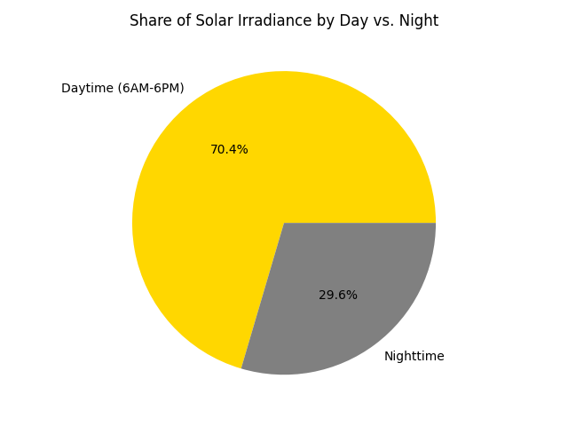
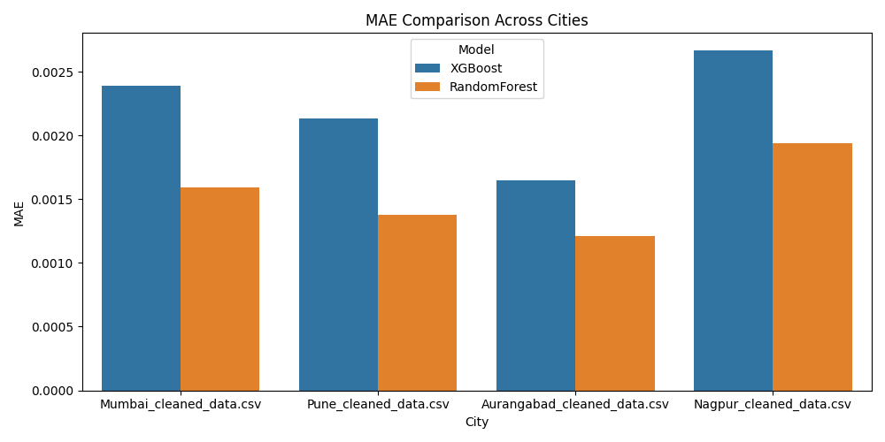
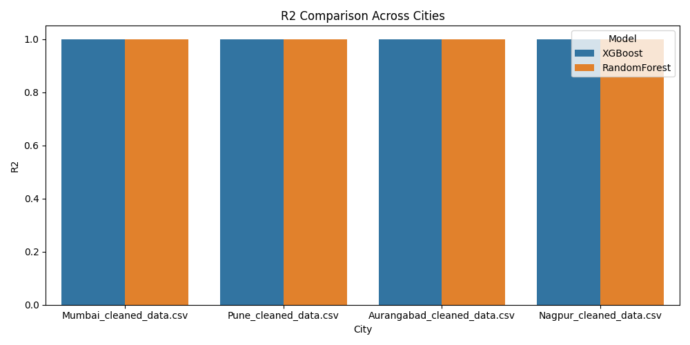
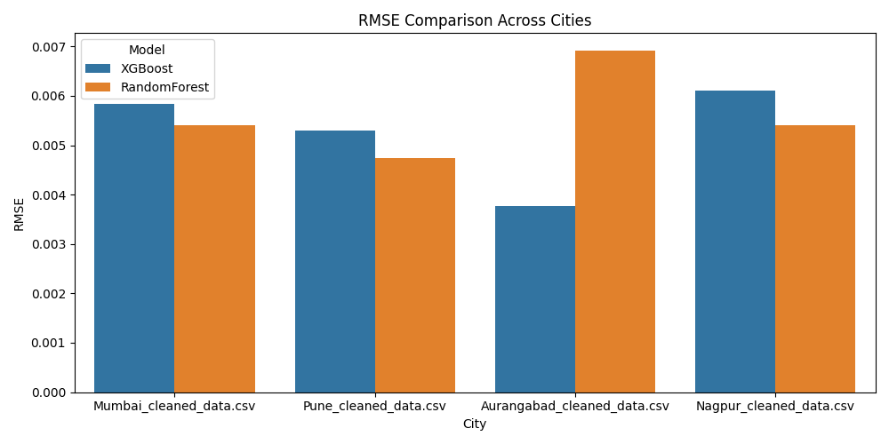

# AI for Sustainable Solar Energy Forecasting and Optimization: AI for Sustainable Solar Energy Forecasting and Optimization (Making Renewable Energy Model for Maharashtra /Solar/Wind using AI/ML
# 

## Project Overview

This project focuses on **optimizing renewable energy systems** for rural Maharashtra using **AI-powered predictive analytics**. We utilize **solar energy data** sourced from the **National Solar Radiation DataBase (NSRDB)** to build forecasting models, optimize energy storage, and improve overall energy management. The project aims to identify optimal energy utilization patterns and inform policies for better energy distribution in rural regions. Using Data form four cites representing four METEOROLOGICAL SUBDIVISION OF MAHARASHTRA for comparituve studies.

The core objectives of this project include:
- **Energy forecasting**: Predicting solar energy output based on historical data to improve energy management.
- **Outlier detection and data normalization**: Cleaning the data and making it suitable for model training.
- **Solar energy optimization**: Analyzing the energy generation capacity based on weather conditions and solar data.

## 📘 Data Dictionary
| Column Name           | Description                                                  | Unit            |
|-----------------------|--------------------------------------------------------------|------------------|
| year                  | Timestamp year                                               | -               |
| month                 | Timestamp month                                              | -               |
| day                   | Timestamp day                                                | -               |
| hour                  | Timestamp hour                                               | -               |
| minute                | Timestamp minute                                             | -               |
| dni                   | Direct Normal Irradiance: sunlight directly from the sun     | W/m²            |
| dhi                   | Diffuse Horizontal Irradiance: scattered sunlight from atmosphere | W/m²        |
| ghi                   | Global Horizontal Irradiance: total solar radiation on a horizontal surface | W/m² |
| dry_bulb              | Air temperature measured in the shade                        | °C              |
| dew_point             | Temperature at which air becomes saturated with moisture     | °C              |
| relative_humidity     | Moisture in the air compared to the maximum it could hold    | %               |
| pressure              | Atmospheric pressure                                         | mbar            |
| wind_direction        | Wind direction (from where wind is coming)                   | Degrees         |
| wind_speed            | Wind speed                                                   | m/s             |
| ghi_clearsky          | Expected irradiance under clear-sky conditions (model-based) | W/m²            |
| dni_clearsky          | Expected direct normal irradiance under clear-sky conditions | W/m²            |
| dhi_clearsky          | Expected diffuse horizontal irradiance under clear-sky conditions | W/m²        |
| solar_zenith_angle    | Angle between sun and vertical above observer                | Degrees         |
| solar_azimuth_angle   | Sun’s direction along the horizon                            | Degrees         |
| solar_elevation_angle | Altitude of the sun above the horizon                        | Degrees         |
| surface_albedo        | Reflectivity of the surface (snow, sand, etc.)               | 0–1 (unitless)  |
| aoi                   | Angle of incidence on the panel                              | Degrees         |
| poa_direct            | Plane-of-array direct radiation                              | W/m²            |
| poa_global            | Total POA radiation (direct + diffuse)                       | W/m²            |
| cell_temperature      | Temperature of the solar cell                                | °C              |
| module_temperature    | Temperature of the entire solar panel                        | °C              |
| dc_voltage            | DC-side electrical voltage                                   | V               |
| dc_current            | DC-side electrical current                                   | A               |
| dc_power              | DC-side electrical power                                     | W               |
| ac_voltage            | AC-side electrical voltage                                   | V               |
| ac_current            | AC-side electrical current                                   | A               |
| ac_power              | AC-side electrical power                                     | W               |
| efficiency            | Inverter or system efficiency                                | % or unitless   |
| capacity_factor       | Ratio of actual output to max possible output                | % or 0–1        |

### Technologies Used
- **Python** for data processing and model training.
- **VS Code** for development.
- **Pandas** and **NumPy** for data manipulation.
- **Matplotlib** and **Seaborn** for data visualization.
- **Scikit-learn** for machine learning models.
- **XGBoost** for predictive modeling.
- **LSTM** (Long Short-Term Memory) networks for time series forecasting.

## Project Structure

The project is organized into the following directories and files:

=> FDA_Project/
├── data/
│   ├── (Raw CSV files from NSRDB)
├── cleaned_data.csv (Processed and cleaned data for each city)
├── analytics.py            # Data cleaning, preprocessing, and visualization
├── model_train.py          # Common model training and evaluation functions
├── xgb_model.py            # XGBoost model implementation
├── lstm_model.py           # LSTM model for time series forecasting
├── modelling.py            # Comparative modeling for Maharashtra cities
├── wind_energy_analysis.py # Wind speed trends and wind energy analysis
├── plot/
│   └── (All output graphs, trends, and visualizations)
├── Makefile                    # Build automation for project
└── README.md                   # Project overview and usage instructions

=> Run all scripts(.py) to see functioning of each file one by one
=> At last Run everything in sequence => command (Makefile) => make grouped-analytics (on terminal)
=> see Output in plots folder

### 🌞 Solar Energy Pie Chart (6 AM - 6 PM)

### 📊 Model Comparison Charts
- 
- 
- 

=> This image shows in months of MAY we have highst GHI and Temp are directly proportional
=> So we can keep stored batteries in these time stored
file:/home/rudra/Pictures/Screenshots/Screenshot from 2025-04-20 15-37-25.png
file:///home/rudra/Desktop/FDA_Project/plots/temp_vs_ghi.png

## 🔧 Data Preprocessing
### How to download data
### Raw Data  openei.org -> explore -> solar -> NERL -> NSRDB -> NSRDB Viewer

The raw data is sourced from the **NSRDB** solar dataset and contains hourly solar irradiance values (GHI, DHI, DNI) along with temperature, wind speed, and other environmental data. The dataset spans an entire year, with data collected for several cities in Maharashtra (Pune, Mumbai, Aurangabad, Nagpur).

### Data Cleaning
We performed the following data cleaning steps:
1. **Removing Metadata**: The first two rows in the raw data contain metadata (e.g., source, units) which were excluded from the dataset.
2. **Handling Missing Values**: We dropped columns with more than 80% missing values and filled missing data where applicable.
3. **Normalization**: We applied **MinMaxScaler** to normalize columns like GHI, temperature, and wind speed for model consistency.
4. **Outlier Detection**: Using the **IQR (Interquartile Range)** method, we detected and removed outliers that could skew model predictions.

## 🛠️ Feature Engineering
1. **Spectral Irradiance**: We extracted and worked with spectral data (GHI, DHI, DNI) to evaluate solar energy generation potential.
2. **Energy Generation Estimation**: Based on GHI values, we estimated the energy generated by solar panels assuming standard panel efficiency and area.
3. **Data Transformation**: We transformed columns to lowercase and replaced spaces with underscores for consistency.

## 📊 Exploratory Data Analysis (EDA)
We performed several visualizations to understand the distribution of key features:
- **Distribution of GHI, temperature, wind speed** using histograms.
- **Correlation heatmaps** to analyze the relationships between energy-related variables.
- **Monthly and daily trends** in GHI and temperature.

## 🤖 Model Training

### 🔷 XGBoost Model

**XGBoost** (Extreme Gradient Boosting) was implemented for **predictive modeling** to estimate solar energy output based on features like temperature, wind speed, and GHI.

#### Steps:
1. **Data Splitting**: We split the cleaned data into **training** and **testing** sets (80%-20%).
2. **Model Training**: XGBoost was trained using the relevant features (`ghi`, `temperature`, `wind_speed`) to predict solar energy generation.
3. **Hyperparameter Tuning**: We optimized hyperparameters like learning rate and max depth to improve model performance.

#### Results:
- **Model Accuracy**: The XGBoost model provided **high accuracy** in predicting energy generation, as the solar irradiance directly affects energy output.
- **Feature Importance**: The model highlighted **GHI** as the most significant predictor of solar energy, followed by temperature and wind speed.

#### Real-World Scenario:
- In the real world, the output from this model can help energy companies predict energy production, allowing them to optimize grid distribution and manage energy storage more effectively.

### 🔶 LSTM Model

**LSTM (Long Short-Term Memory)** networks were used for **time-series forecasting** of solar energy based on historical solar irradiance data.

#### Steps:
1. **Data Transformation**: Time-series data was prepared with hourly GHI values as the target variable.
2. **Model Architecture**: We used a **simple LSTM network** with a few layers to capture temporal dependencies in the solar data.
3. **Model Training**: The LSTM model was trained to predict future solar irradiance values based on past data.
4. **Evaluation**: The model's performance was evaluated using **mean absolute error (MAE)** and **root mean squared error (RMSE)**.

#### Results:
- **Forecasting Accuracy**: The LSTM model provided **high accuracy** for predicting solar energy production, especially when capturing seasonal and daily patterns.
- **Performance**: The model was able to forecast energy generation for future days based on past solar radiation data.

#### Real-World Scenario:
- The LSTM model's output can be used for **day-ahead energy forecasting**, helping energy companies better plan for energy storage and distribution, and anticipate the need for backup power sources (e.g., batteries or grid support).

## 🔋 Energy Optimization & Battery Storage

The project also involved evaluating **battery storage optimization** to improve the efficiency of solar energy use. Based on predicted solar energy generation, we assessed how much energy can be stored during the day and used during the night.

### Steps:
1. **Energy Generation**: Solar energy generation was calculated using GHI, panel area, and efficiency.
2. **Energy Storage**: We modeled how excess energy generated during the day could be stored in a **battery** for later use.
3. **Battery Efficiency**: Battery losses were accounted for, with efficiency assumed to be 85%.
4. **Optimization**: We used the available energy forecasts to determine the optimal battery size for each city, ensuring energy demand is met during nighttime.

## 📈 Results & Impact

- **Solar Energy Generation**: The XGBoost and LSTM models provided reliable predictions for energy generation based on historical solar data.
- **Battery Storage**: We successfully demonstrated how battery storage can optimize energy usage, particularly in rural areas where grid access is limited or unreliable.
- **Real-World Application**: This project can help:
  - **Solar energy developers** in rural Maharashtra estimate energy generation potential.
  - **Energy policymakers** optimize energy distribution by understanding solar energy patterns.
  - **Energy consumers** (e.g., farmers, rural households) benefit from more reliable and cost-effective solar energy systems.

## 🔮 Future Work
- **Incorporating More Data**: We plan to include additional datasets such as wind energy, temperature forecasts, and energy consumption data to further improve forecasting and optimization.
- **Advanced Battery Optimization**: Future work will involve more complex **battery optimization algorithms** and integration of different energy storage systems.
- **Real-Time Forecasting**: Implementing **real-time forecasting** models to help in daily energy management decisions.

## 🚀 How to Run the Project

Install python3

1. **Install Required Libraries**:
   Create a virtual environment and install the dependencies:
      
   python -m venv env
  
   pip install pandas
   pip install matplotlib
   pip install seaborn
   pip install scipy
   pip install scikit-learn
   pip install matplotlib
   
   pip install <library> (If any)
   
2. **Running the Analytics Script**:
   To preprocess the data and generate visualizations:
   
   python analytics.py
   

3. **Training Models**:
   - To train the XGBoost model:
     
   run  python3 xgb_model.py
     
   - To train the LSTM model:
     
     python3 lstm_model.py 
  
     
 =># Wind flow trend for wind energy purpose using wind_speed of four cities wind_energy_analysis.py
 =>file:///home/rudra/Pictures/Screenshots/Screenshot%20from%202025-04-20%2016-15-25.png
       

4. **Generating the Final Predictions**:
   After training, use the models to make predictions for energy generation and storage optimization.

## ✅ Conclusion

This project provides a comprehensive solution for optimizing solar energy generation and usage in rural Maharashtra. By leveraging AI and machine learning models, we have built an effective forecasting system that can inform better energy management decisions. Additionally, the integration of battery storage optimization will enhance the reliability of solar energy systems, making them more viable for off-grid rural areas.
